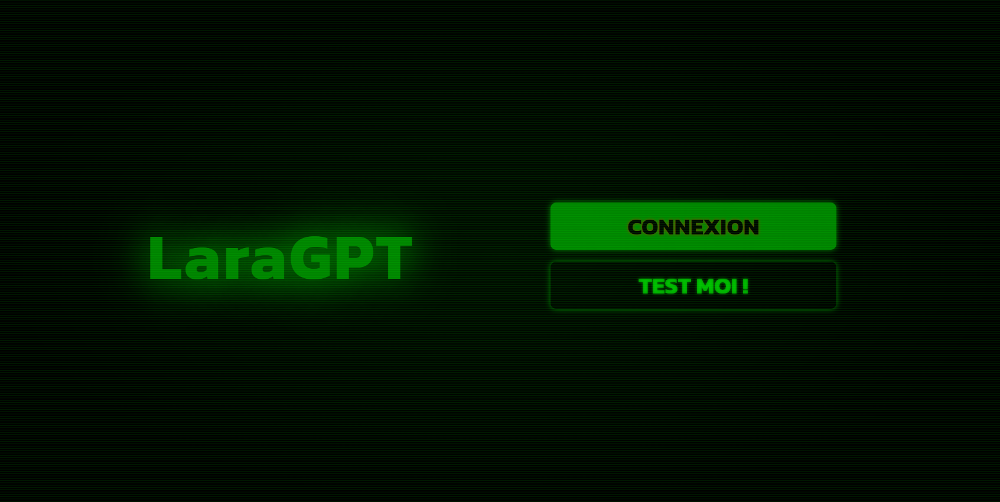
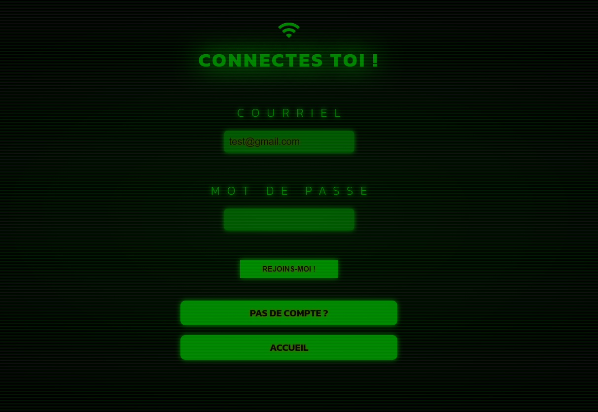
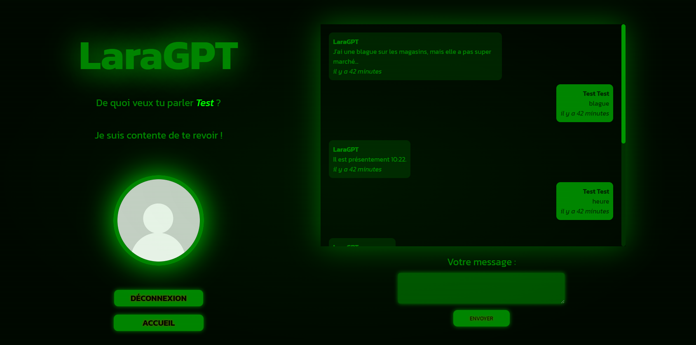

  

# INSTALLER LaraGPT
## 1 - INSTALLER LES FICHIERS NECESSAIRES À LARAVEL :

- Dans le terminal de votre éditeur de code, taper : composer install
- Dans le fichier .env entrer le nom de votre BDD à cette section : DB_DATABASE=nom_de_votre_bdd

## 2 - BASE DE DONNÉES & COMMANDES :

- Créer une base de donnée vide dans PhpMyAdmin.
- Dans le terminal de votre éditeur de code, éxecuter les migrations pour peupler la BDD avec la commande : php artisan migrate:fresh --seed
- Dans le terminal de votre éditeur de code, lancer un serveur de developpement Laravel. Éxecuter la commande : php artisan serve
- Aller à l'URL http://127.0.0.1:8000

## 3 - LES COMPTES & CONVERSATIONS
- Vous pouvez créer un compte OU vous connecter avec un des comptes factices de la BDD dont le mot de passe est PASSWORD.
- Dans votre conversation avec LaraGPT vous pouvez entrer les phrases que vous trouverez dans ce fichier : storage/app/data/phrases.json

